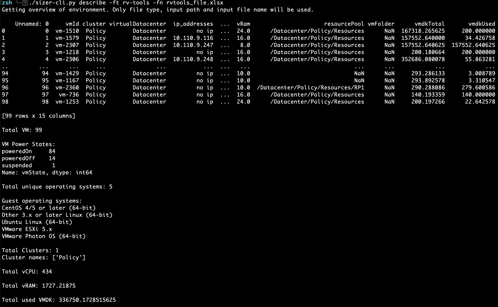
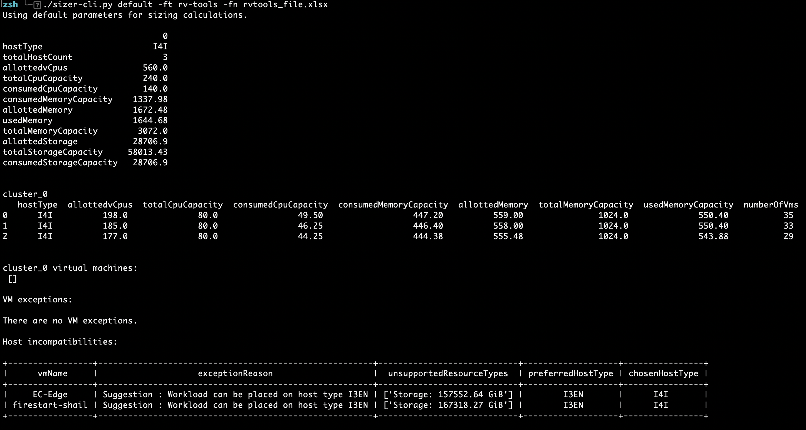
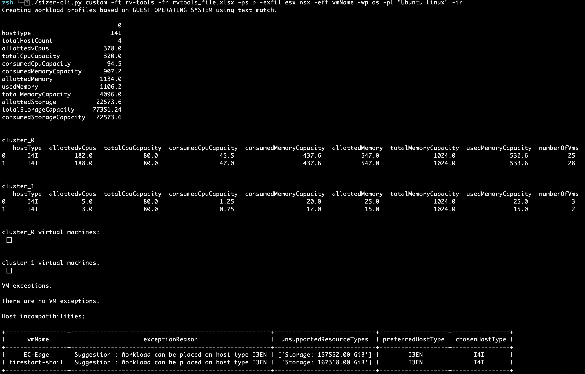
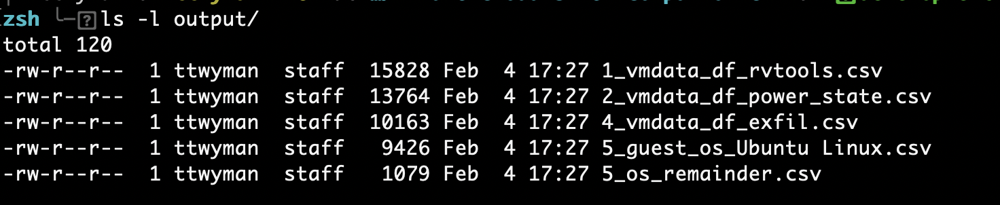
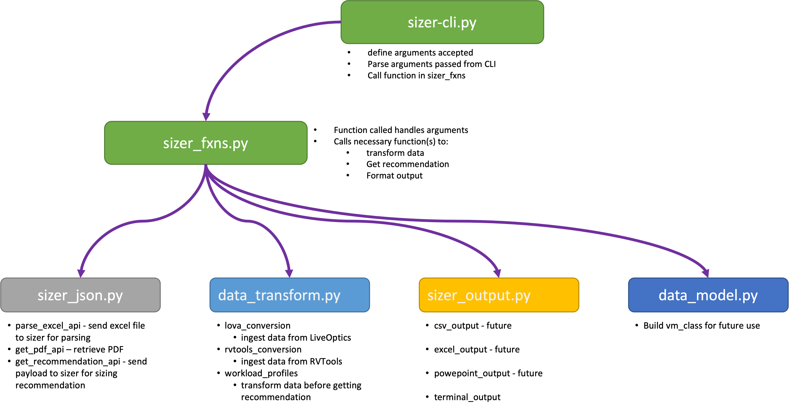

# VMware Cloud Sizer Companion CLI

A python client 'companion' tool for sizing workloads for migration to VMware Cloud.

## 1.1 What is the VMware Cloud Sizer Companion CLI?
Welcome to the VMware Cloud Sizer Companion CLI!  VMware Cloud Sizer Companion CLI is a Python tool developed for assisting customers, consultants, presales engineers, and anyone else for sizing workloads for VMware Cloud.

## 1.2 Overview

VMware Cloud Sizer Companion CLI was created by Tom Twyman and Chris White.  This tool can be used to help you quickly and reliably retrieve sizings for VMware Cloud via the command line.  It is intended primarily as a tool to take file data - either from RVTools or LiveOptics - and either immediately retrieve a sizing recommendation, or to allow the user to transform the data (using a set of predefined transformations) before retrieving a recommendation.

## 1.3 Features
Current 'out of the box' capabilities include:
- Ingest either a LiveOptics or RVTools file
- Provide a quick review (“view_only”) option to summarize the environment
- Retrieve a sizing recommendation for the environment
- Include all VM, or only those powered on / suspended
- Include specific workloads by VM Name, cluster, or Guest operating system
- Exclude specific workloads by VM Name, cluster, or Guest operating system
- Create workload profiles based on:
  - Current vm:cluster distribution – all clusters
  - Current vm:cluster distribution – some clusters
  - Guest OS based on text string filter
  - VM name based on text string filter
- Present results on-screen
- Identify VM exceptions or host incompatibilities
- Optionally save to PDF as well


## 1.4 Getting Started

### 1.4.1 Install Python
This tool is dependent on Python3 (specifically 3.10), you can find installation instructions for your operating system in the Python documentation (https://wiki.python.org/moin/BeginnersGuide/Download).

### 1.4.2 Download code
If you know git, clone the repo with
```git clone https://github.com/vmware-samples/vmware-cloud-sizer-companion-cli.git ```


### 1.4.3 Install Python modules and packages
When you navigate to the pyvmcsizer folder, you will find a requirements.txt file that lists all your Python packages. They can all be installed by running the following command on Linux/Mac:

```pip3 install -r requirements.txt```

On Windows, use

```python -m pip install -r requirements.txt```

### 1.4.5 Do I need to know Python?
No! You can simply use it interactively at the command line, or in a script.

## 1.5 Running the Script
This is super easy...
- run ./sizerimporter.py to see the current list of supported commands.
- use '-h' to see the supported arguments / parameters.

### 1.5.1 Suggested Workflow
First, run get an overview of the environment:
```./sizer-cli.py describe -ft rv-tools -fn rvtools_file.xlsx```

This will give you a good review of what's in your file, as shown by the image below.


Next, you can add some options to your command to transform the data, or just get a recommendation.  

To simply submit the file to the Sizer and get a recommendation without any filtering / changes to the data at all, simply change "view_only" to "default":
```./sizer-cli.py default -ft rv-tools -fn rvtools_file.xlsx```



As you can see, not only does this simply return a result, it will also identify any workloads that either can't be placed, or that will fit better on certain host types.

Finally, if you wish to customize the data in any way before getting a recommendation, change "default" to "custom"...  there are several transformations you can use:
- "-p" | "--power_state" - select workloads by power state using
- "-infil" | "--inlude_filter" - include only workloads matching a text string.  Use this with "-iff" | "--include_filter_field" to indicate what field to filter by (Guest OS, VM name, or cluster name).
- "-exfil" | "--exlude_filter" - include only workloads matching a text string.  Use this with "-eff" | "--exclude_filter_field" to indicate what field to filter by (Guest OS, VM name, or cluster name).
- "-wp" | "--workload_profiles" - group workloads into 'workload profiles', which can then be placed on their own clusters.  Use this with "-pl" | "--profile_list" to indicate the desired groupings.

In the example below, the dataset has been modified as follows:
- filtered to only include powered-on workloads
- exclude any VMs with either "esx" or "nsx" in the name
- create a workload profile in its own cluster for any VMs identified as running "Ubuntu Linux" in one cluster
- create a workload profile for all remaining VMs in a separate cluster:
```./sizer-cli.py custom -ft rv-tools -fn rvtools_file.xlsx -ps p -exfil esx nsx -eff vmName -wp os -pl "Ubuntu Linux" -ir```



### 1.5.2 A Note about filter ordering:
Take care when using filtering - if the correct arguments are provided, all of the above filters may be applied to your file.  Note that the filters are applied in the order indicated below, regardless of the order the arguments are provided.... 
1. Filtering based on power state is performed first.
2. ... then filters are applied to only include workloads based on arguments
3. ... then filters are applied to exclude workloads based on arguments
4. ... then workload profiles are created based on arguments

Furthermore, note that the original file will never actually be altered - it is read into memory, and though filtering and grouping may be applied to the data, the original file will remain untouched.  Each filter applied will result in a new subset of data that will be stored on the drive in the "output" folder - in this fashion you may track how the data set has changed as a result of each filter.



### 1.5.3 Text String searching
Avoid the use of special characters when using text strings for filtering (such as asterisks, parentheses, etc).

## 1.6 Project Structure

For those of you interested in getting 'under the covers,' this project is split up amongst several files.



* sizerimporter.py - contains the _main_ function, which defines all the arguments accepted, help for the command, etc.  It also makes calls to other functions based on what arguments are passed
* sizer_json.py - functions that call the VMware Cloud Sizer API - specifically for parsing an Excel file and obtaining a sizing recommendation.
* data_transform.py - functions that ingest data from an Excel file (LiveOptics or RVTools), and optionally transform the data before sending it to the sizer for a recommendation
* sizer_output.py - functions to handle the output of data

## Contributing

The vmware-cloud-sizer-companion-cli project team welcomes contributions from the community. Before you start working with vmware-cloud-sizer-companion-cli, please
read our [Developer Certificate of Origin](https://cla.vmware.com/dco). All contributions to this repository must be
signed as described on that page. Your signature certifies that you wrote the patch or have the right to pass it on
as an open-source patch. For more detailed information, refer to [CONTRIBUTING.md](CONTRIBUTING.md).

## License

